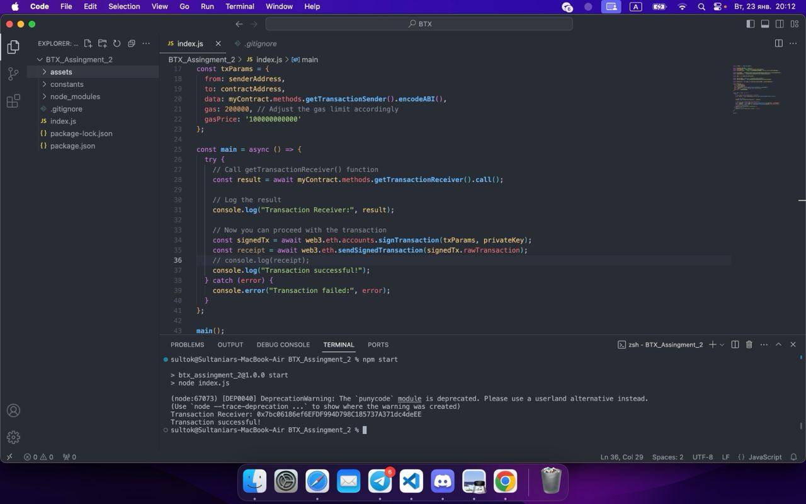
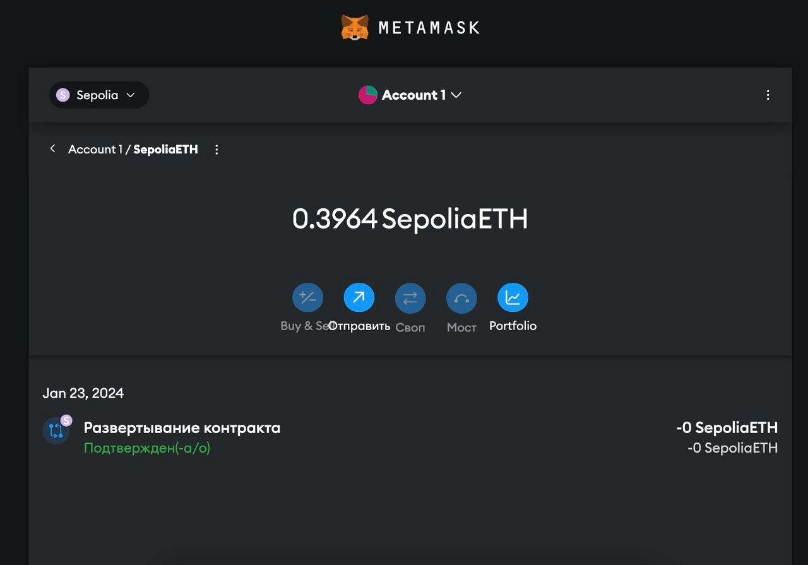

# BTX_Assingment_2 (Kuandyk Sultaniyar)

## Usage

This Node.js script facilitates the sending of transactions on the Ethereum blockchain using the [Web3.js](https://github.com/ethereum/web3.js/) library. It is specifically designed to interact with a smart contract deployed on the Sepolia test network. The script sends a transaction from a specified sender address to a predefined contract address, calling a method to retrieve transaction information from the smart contract.

## Demo

  

## Examples

### Prerequisites

- Node.js installed
- Ethereum wallet with a private key for the sender address
- Infura API key for connecting to the Ethereum network

### Installation

1. Clone the repository: `https://github.com/SultokTheF/BTX_Assingment_2`
2. Install dependencies: `npm install`

### Configuration

1. Open the `index.js` file.
2. Replace `infuraApiKey` with your Infura API key.
3. Replace `privateKey` with the private key of your Ethereum wallet.
4. Ensure `senderAddress` corresponds to your Ethereum wallet address.
5. Adjust other parameters like gas and gas price if necessary.

### Run

Execute the script by running: `npm start`

## Disclaimer

This script is provided as-is and should be used responsibly. Ensure you have ownership of the private key and abide by the Ethereum network's rules and regulations. Use this script at your own risk.

## License

This project is licensed under the [MIT License](LICENSE).
